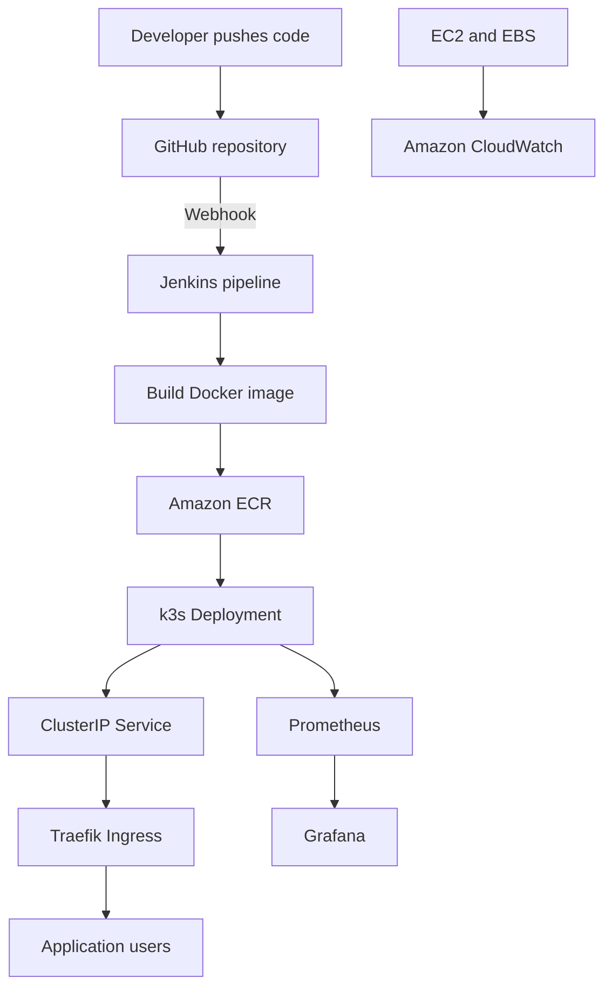

# CloudOps Incident Portal – AWS DevOps CI/CD Project

An end-to-end DevOps project that containerizes a FastAPI incident-management application, pushes versioned images to Amazon ECR, deploys them to a Kubernetes cluster, exposes the application through Traefik Ingress, and monitors the environment using Prometheus, Grafana, and Amazon CloudWatch.

## Project Overview

The purpose of this project was to practise a realistic application-delivery workflow on AWS:

- Host the DevOps environment on an Ubuntu EC2 instance.
- Package a FastAPI application as a Docker image.
- Store versioned container images in Amazon ECR.
- Trigger Jenkins automatically through a GitHub webhook.
- Deploy new application versions to a k3s Kubernetes cluster.
- Use health probes and rolling updates for safer deployments.
- Route external traffic through Traefik Ingress.
- Monitor AWS infrastructure and Kubernetes workloads.

## Architecture



## Technology Stack

| Area | Technology |
|---|---|
| Cloud platform | AWS |
| Compute | Amazon EC2 – Ubuntu |
| Identity and access | AWS IAM user and EC2 IAM role |
| Object storage | Amazon S3 |
| Block storage | Amazon EBS gp3 |
| Application | Python, FastAPI, Uvicorn, SQLite |
| Containerization | Docker |
| Image registry | Amazon ECR |
| CI/CD | Jenkins and GitHub Webhook |
| Container orchestration | k3s Kubernetes |
| Traffic routing | ClusterIP Service and Traefik Ingress |
| Monitoring | Prometheus, Grafana and Amazon CloudWatch |
| Package management | Helm |

## Application Features

The Incident Portal provides a small operational dashboard with:

- Incident creation and tracking
- Incident priority, status and ownership
- Service-health information
- Dashboard statistics
- Application health endpoint at `/health`

The health endpoint is used by Kubernetes probes and deployment verification:

```bash
curl http://localhost:8000/health
```

Expected response:

```json
{
  "status": "healthy",
  "service": "cloudops-portal",
  "version": "1.0.0"
}
```

## Running the Application Locally

Create and activate a Python virtual environment:

```bash
python3 -m venv venv
source venv/bin/activate
pip install -r requirements.txt
```

Start the application:

```bash
uvicorn app.main:app --host 0.0.0.0 --port 8000
```

The expression `app.main:app` refers to the `app` FastAPI object inside `app/main.py`.

## Docker

Build the image:

```bash
docker build -t incident-portal:v1 .
```

Run the container:

```bash
docker run -d \
  --name incident-portal \
  -p 8000:8000 \
  incident-portal:v1
```

Verify it:

```bash
docker ps
docker logs incident-portal
curl http://localhost:8000/health
```

## Amazon ECR

Jenkins uses the EC2 IAM role to obtain temporary ECR credentials. Permanent AWS access keys are not stored on the server.

Authenticate Docker with ECR:

```bash
aws ecr get-login-password --region <AWS_REGION> |
docker login --username AWS --password-stdin <ECR_REGISTRY>
```

Tag and push an image:

```bash
docker tag incident-portal:<TAG> <ECR_REGISTRY>/incident-portal:<TAG>
docker push <ECR_REGISTRY>/incident-portal:<TAG>
```

Each Jenkins build number is used as an immutable image tag. For example, Jenkins build `8` produces `incident-portal:8`. This provides traceability and makes rollback easier.

## Jenkins CI/CD Pipeline

A GitHub webhook triggers Jenkins whenever code is pushed to the configured branch.

The pipeline performs the following stages:

1. Checks out the latest source code using `checkout scm`.
2. Builds a Docker image tagged with `${BUILD_NUMBER}`.
3. Authenticates Docker with Amazon ECR.
4. Pushes the versioned image to ECR.
5. Refreshes the Kubernetes ECR pull secret.
6. Updates the Kubernetes Deployment with the new image.
7. Waits for the rolling update to complete.
8. Calls the health endpoint to verify the deployment.

The Deployment image is updated with:

```bash
kubectl set image deployment/incident-portal \
  incident-portal=<ECR_REGISTRY>/incident-portal:${BUILD_NUMBER}
```

This changes the live Deployment image. Kubernetes then creates a new ReplicaSet, starts new Pods, waits for readiness checks, and terminates the old Pods.

The rollout is verified using:

```bash
kubectl rollout status deployment/incident-portal --timeout=120s
```

> `kubectl set image` updates the live cluster but does not rewrite the image tag stored in `kubernetes.yaml`. In a larger environment, Helm, Kustomize, or GitOps can keep the declared and deployed versions synchronized.

## Kubernetes Components

### Deployment

The Deployment defines the desired Pod count, ECR image, container port, health probes and image-pull secret. It also manages rolling updates and ReplicaSets.

### ClusterIP Service

The Service gives the application Pods a stable internal IP and DNS name. It selects healthy Pods by label and distributes internal traffic across the available endpoints.

### Traefik Ingress

k3s includes Traefik as its default Ingress Controller. The Ingress resource routes incoming HTTP requests on port 80 to the ClusterIP Service on port 8000.

```text
Internet → EC2 port 80 → Traefik → ClusterIP Service → Ready Pod
```

This lab demonstrates Kubernetes pod-level traffic distribution on one EC2 instance. A production AWS architecture would normally use multiple worker nodes and an AWS Application Load Balancer or Network Load Balancer.

### Readiness and Liveness Probes

Both probes call `/health`:

- **Readiness probe:** controls whether the Pod can receive Service traffic.
- **Liveness probe:** restarts the container when the application becomes unhealthy.

## Monitoring

### Prometheus

Prometheus collects and stores time-series metrics from Kubernetes components, nodes and containers. The `kube-prometheus-stack` was installed using Helm.

Useful PromQL queries include:

```promql
up
```

```promql
kube_pod_status_phase{namespace="default"}
```

```promql
rate(container_cpu_usage_seconds_total{namespace="default", container!="", image!=""}[5m])
```

### Grafana

Grafana uses Prometheus as a data source and visualizes:

- Cluster CPU and memory utilization
- Node resource consumption
- Namespace usage
- Pod health and restarts
- Kubernetes resource requests and limits

### Amazon CloudWatch

A CloudWatch dashboard was created for AWS infrastructure metrics:

- `CPUUtilization`
- `NetworkIn` and `NetworkOut`
- `EBSReadBytes` and `EBSWriteBytes`
- `StatusCheckFailed`

Default EC2 metrics do not provide operating-system memory usage or filesystem-used percentage. Those metrics require the CloudWatch Agent.

## Screenshots

### Incident Portal


### Jenkins CI/CD Pipeline


### Kubernetes Monitoring with Grafana


### AWS CloudWatch Dashboard


## Troubleshooting Performed

### SSH connection timed out

The laptop's public IP had changed, but the Security Group allowed the old IP. Port 22 was updated to allow the current public IP with a `/32` CIDR.

### AWS CLI returned `UnauthorizedOperation`

The IAM identity did not have the requested EC2 permission. The relevant identity-based policy was reviewed and updated.

### ECR authentication was denied

The original EC2 role did not allow `ecr:GetAuthorizationToken`. The role was updated with the permissions required to authenticate and push images.

### Uvicorn could not load the application

The incorrect command used `app:app`, but the FastAPI object was located in `app/main.py`. It was corrected to `app.main:app`.

### Container exited immediately

`docker ps -a` and `docker logs <container>` were used to inspect its exit status and startup error.

### Jenkins could not access Docker

The Jenkins Linux user did not have access to `/var/run/docker.sock`. Jenkins was added to the Docker group and access was verified using:

```bash
sudo -u jenkins docker ps
```

### Jenkins waited for an available executor

Jenkins marked its built-in node unavailable because the EC2 root filesystem had insufficient free space. Disk usage was verified with `df -h /`.

### EBS capacity was not visible in Linux

Increasing the EBS volume changed the block-device size, but the Linux partition and filesystem also needed expansion. The result was checked using `lsblk` and `df -h /`.

### Kubernetes reverted to an older image

Jenkins had updated the live Deployment, but `kubernetes.yaml` still contained an older tag. Applying that manifest restored the old declared image. This demonstrated the difference between live cluster state and Git-managed desired state.

### Jenkins verification failed on `localhost:30080`

The application rollout succeeded, but the verification URL was incorrect for the current Service configuration. The pipeline was changed to retrieve the Service ClusterIP and call port 8000 directly.

## Security Considerations

- Restrict SSH access to an administrator IP instead of `0.0.0.0/0`.
- Do not commit `.pem` files, access keys, passwords, ECR tokens or Kubernetes secrets.
- Use EC2 IAM roles and temporary credentials.
- Keep S3 Block Public Access enabled unless public access is genuinely required.
- Avoid exposing Jenkins directly to the internet in production.
- Use HTTPS, authentication, network restrictions and least-privilege IAM policies.
- Do not paste complete ECR login tokens into logs or documentation.

## Useful Verification Commands

```bash
# Docker
docker ps
docker images

# Kubernetes
kubectl get nodes
kubectl get deployment,pods,service,ingress
kubectl describe pod <POD_NAME>
kubectl logs <POD_NAME>

# Current deployed image
kubectl get deployment incident-portal \
  -o jsonpath='{.spec.template.spec.containers[0].image}'; echo

# Rollout
kubectl rollout status deployment/incident-portal
kubectl rollout history deployment/incident-portal

# Application health
curl http://<SERVICE_IP>:8000/health

# Monitoring
kubectl get pods -n monitoring
```

## Key Learning Outcomes

- Built an automated CI/CD workflow from GitHub to Kubernetes.
- Used IAM roles to provide temporary AWS permissions to EC2 workloads.
- Created, versioned and stored container images in Amazon ECR.
- Implemented Kubernetes rolling deployments and health probes.
- Configured ClusterIP Service and Traefik Ingress routing.
- Monitored Kubernetes through Prometheus and Grafana.
- Monitored EC2, network and EBS activity through CloudWatch.
- Diagnosed real permission, storage, networking and deployment failures.

## Interview Summary

> I built an end-to-end CI/CD project on AWS for a FastAPI Incident Portal. A GitHub webhook triggered Jenkins, which checked out the code, built a Docker image, tagged it with the Jenkins build number, and pushed it to Amazon ECR using an EC2 IAM role. Jenkins then updated a k3s Kubernetes Deployment and verified its rolling rollout and health endpoint. I exposed the application through a ClusterIP Service and Traefik Ingress. I installed Prometheus and Grafana for Kubernetes monitoring and created a CloudWatch dashboard for EC2 and EBS metrics. During implementation, I resolved IAM, SSH, Docker permission, disk-capacity, image-version and deployment-verification issues.

## Future Improvements

- Add automated unit and integration tests before image creation.
- Define CPU and memory requests and limits.
- Configure Horizontal Pod Autoscaling.
- Add Alertmanager or Grafana alert notifications.
- Manage Kubernetes releases through Helm.
- Use GitOps with Argo CD.
- Store persistent application data in a managed database.
- Use Amazon EKS and an AWS load balancer for production-grade high availability.

## Author

**Apurva Panchal**

Built as a hands-on AWS, CI/CD, Docker, Kubernetes and monitoring project for DevOps engineering practice.
